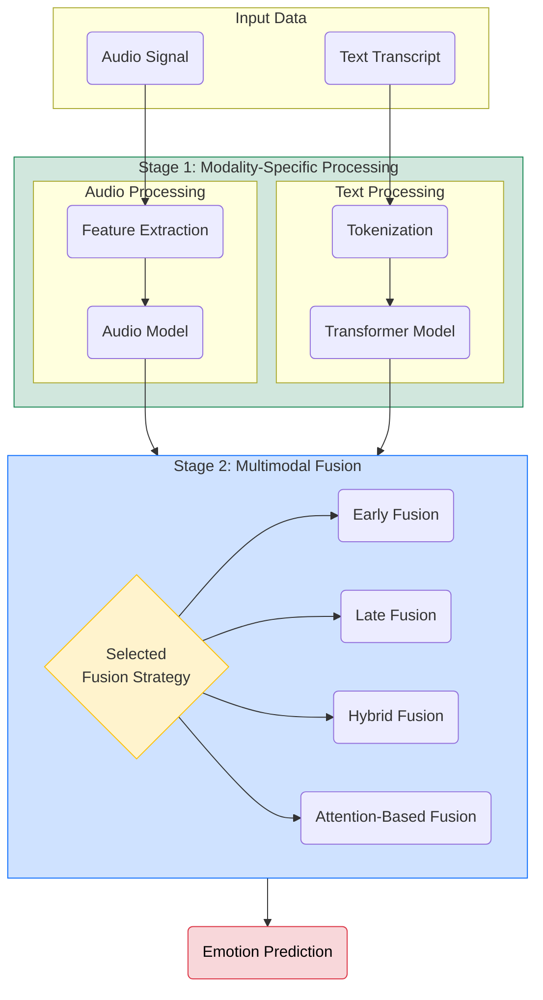
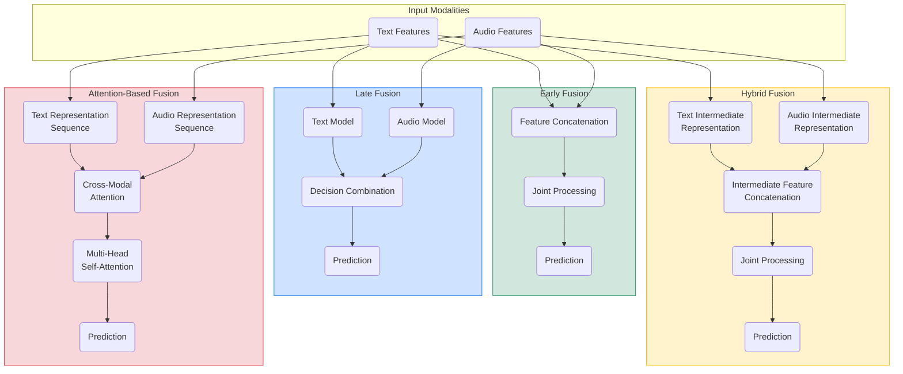
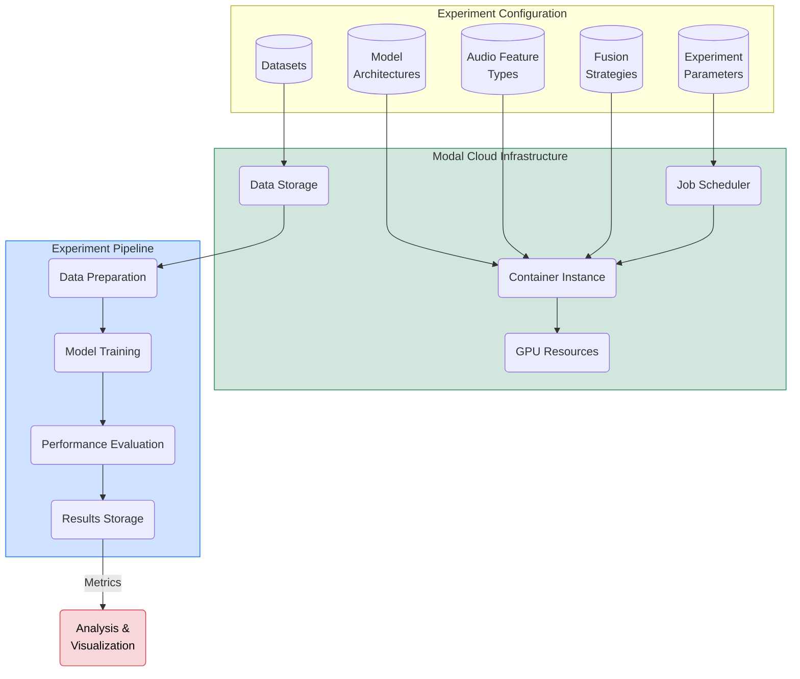

# Mermaid Diagram Definitions for Emotion Recognition Architecture

## 1. High-Level System Architecture



## 2. Text Model Architecture Detail

```mermaid
flowchart TD
    Text("Text Input") --> Tokenizer("Tokenizer\n(Model-specific)")
    Tokenizer --> TokenIDs("Token IDs + Attention Mask")
    
    subgraph TransformerEncoder["Transformer Encoder"]
        Embedding("Token + Position Embedding")
        Attention("Self-Attention Layer")
        FFN("Feed-Forward Network")
        Norm("Layer Normalization")
        
        Embedding --> Attention
        Attention --> FFN
        FFN --> Norm
        Norm --> |Next Layer| TransformerEncoder
    end
    
    TokenIDs --> Embedding
    
    TransformerEncoder --> CLSToken("CLS Token Representation")
    CLSToken --> ClassificationHead("Classification Head")
    ClassificationHead --> Output("Emotion Prediction")
    
    style TransformerEncoder fill:#d1e7dd,stroke:#198754
    style ClassificationHead fill:#cfe2ff,stroke:#0d6efd
    style Output fill:#f8d7da,stroke:#dc3545,color:#000
```

## 3. Fusion Strategies Comparison



## 4. MFCC Feature Extraction Pipeline

```mermaid
flowchart LR
    Audio("Raw Audio Signal") --> Preemphasis("Pre-emphasis")
    Preemphasis --> Framing("Framing\n(25ms windows)")
    Framing --> Windowing("Hamming Window")
    Windowing --> FFT("Fast Fourier Transform")
    FFT --> PowerSpectrum("Power Spectrum")
    PowerSpectrum --> MelFilter("Mel Filter Bank\n(40 filters)")
    MelFilter --> LogCompression("Log Compression")
    LogCompression --> DCT("Discrete Cosine Transform")
    DCT --> MFCC("MFCC Features\n(40 coefficients)")
    
    MFCC --> DeltaFeatures("Delta & Delta-Delta\nCoefficients")
    DeltaFeatures --> Normalization("Z-score Normalization")
    Normalization --> FinalFeatures("Final Feature Vector")
    
    style Audio fill:#d1e7dd,stroke:#198754
    style MelFilter fill:#cfe2ff,stroke:#0d6efd
    style MFCC fill:#fff3cd,stroke:#ffc107
    style FinalFeatures fill:#f8d7da,stroke:#dc3545
```



## 5. Experiment Execution Framework



To render these diagrams:
1. Visit [Mermaid Live Editor](https://mermaid.live/) 
2. Paste the code for each diagram
3. Export as PNG or SVG
4. Include in your LaTeX document

Alternatively, you can use the Mermaid CLI to render these diagrams directly:
```bash
npx @mermaid-js/mermaid-cli -i input.mmd -o output.svg
``` 