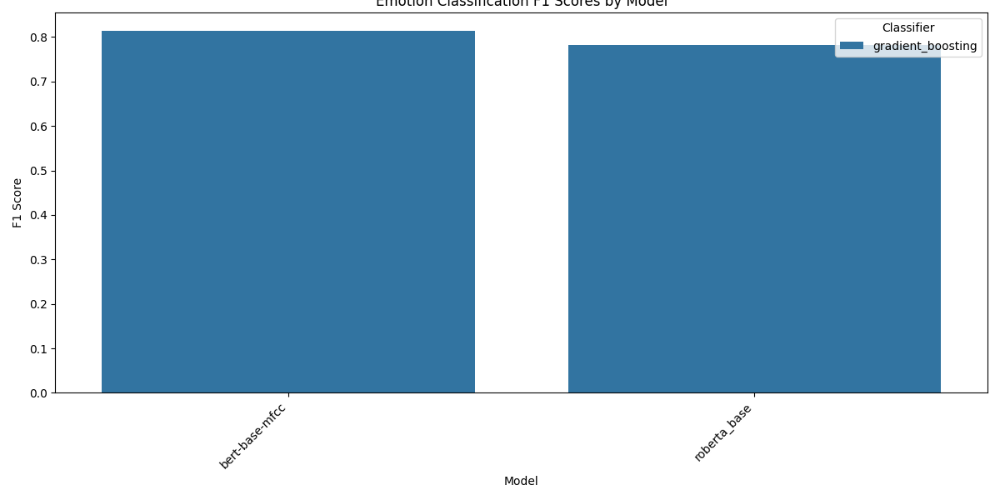
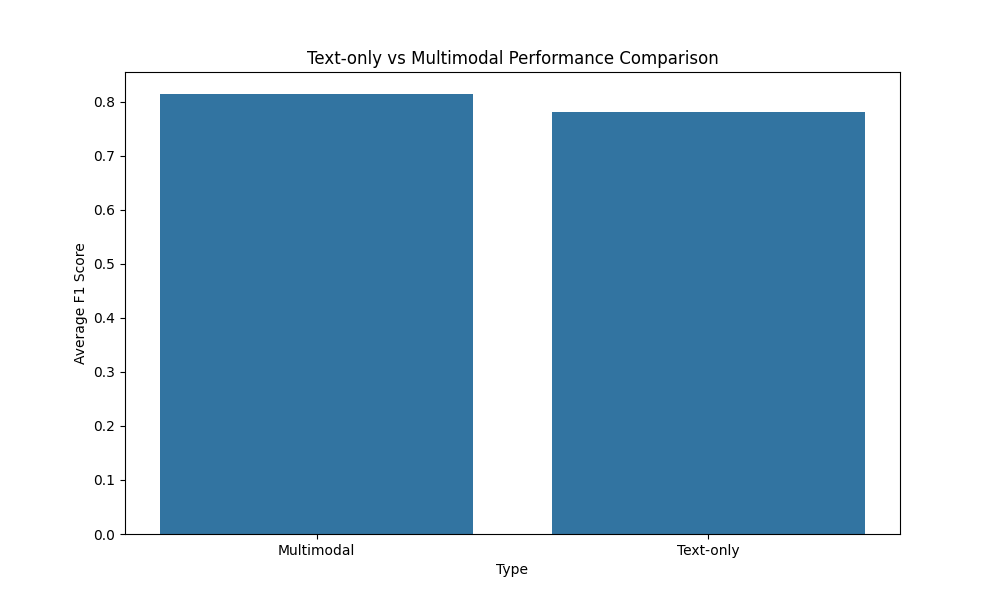

# EMOD Experiment Results Report

Generated on 2025-05-08 12:40:54

## Summary

- Total experiments analyzed: 2
- Text-only models: 1
- Multimodal models: 1

## Performance Overview

### Stage 1: VAD Prediction Performance

The following table shows the Mean Squared Error (MSE) for Valence, Arousal, and Dominance prediction across all models:

No data available

### Stage 2: Emotion Classification Performance

The following table shows the classification performance metrics across all models:

| Type       | Model        | Audio   | Fusion   | Best Classifier   |   Accuracy |   F1 Score |
|:-----------|:-------------|:--------|:---------|:------------------|-----------:|-----------:|
| Multimodal | bert         | base    | mfcc     | gradient_boosting |     0.8156 |     0.8143 |
| Text-only  | roberta_base | nan     | nan      | gradient_boosting |     0.7823 |     0.7812 |

## Performance Comparisons

### Top Performing Models

Ranked by lowest Mean Squared Error (MSE) on the Valence dimension:

No data available

Ranked by highest Weighted F1 Score:

| Type       | Audio   | Fusion   | Best Classifier   |   Best Accuracy |   Best F1 |
|:-----------|:--------|:---------|:------------------|----------------:|----------:|
| Multimodal | base    | mfcc     | gradient_boosting |          0.8156 |    0.8143 |
| Text-only  | nan     | nan      | gradient_boosting |          0.7823 |    0.7812 |

## Experiment Details

### Text-Only Models

| Model        | Best Classifier   |   Best Accuracy |   Best F1 |
|:-------------|:------------------|----------------:|----------:|
| roberta_base | gradient_boosting |          0.7823 |    0.7812 |

### Multimodal Models

| Model   | Audio   | Fusion   | Best Classifier   |   Best Accuracy |   Best F1 |
|:--------|:--------|:---------|:------------------|----------------:|----------:|
| bert    | base    | mfcc     | gradient_boosting |          0.8156 |    0.8143 |

## Visualizations

### VAD Prediction Performance Comparison

### Emotion Classification F1 Scores

### Text vs Multimodal Performance

### Training Curves

Training curves for all experiments are available in the `training_curves` directory.

## Detailed Results

Detailed results for each experiment are available in their respective directories within the `results` directory.

## Methodology

Experiments were conducted using the EMOD two-stage emotion recognition system:

1. **Stage 1**: Convert input (text and/or audio) to Valence-Arousal-Dominance (VAD) tuples
2. **Stage 2**: Classify emotions into four categories (happy, angry, sad, neutral)

For multimodal experiments, different fusion strategies were tested to combine text and audio features.

## Model Architectures

### Text Encoders
- RoBERTa
- BERT/DeBERTa
- DistilBERT
- XLNet
- ALBERT

### Audio Features
- MFCC
- Spectrogram
- Prosodic features
- wav2vec embeddings

### Fusion Strategies
- Early fusion
- Late fusion
- Hybrid fusion
- Attention-based fusion

### ML Classifiers
- Random Forest
- Gradient Boosting
- Support Vector Machines (SVM)
- Logistic Regression
- Multi-layer Perceptron (MLP)
